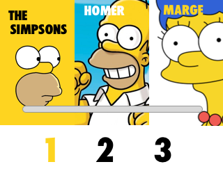

result

GitHub-Page ![https://dns2316.github.io/SimpsonsMenu-with-json/] (https://dns2316.github.io/SimpsonsMenu-with-json/)

task

### Technologies

This project is to be built using React.js  
you may use any css framework you like

**Focus on proper project architecture and file structure is very important here!**

### Goal
The goal of this project is to build a basic view component that can display using multiple layouts.

### View component

The view component is made out of a cover, index, items

##### Cover

Cover is made out of an image, title and title color.

##### Items
Each item contains an image, title and title color.

##### Index

The index displays the currently scrolled item.  
So as you scroll it moves with the first item in view.

### Data

The view component is built using json like this [data.json](src/data.json)

### Layouts
At first we need to support 3 layouts:

1. 

2. 

3. 

  * Grey bar indicates that there is a scroll bar
